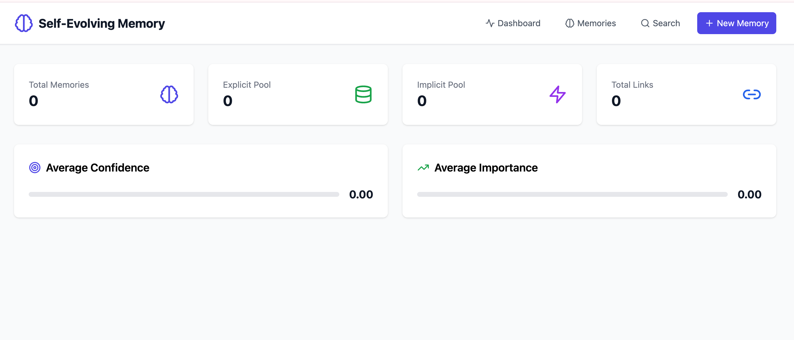
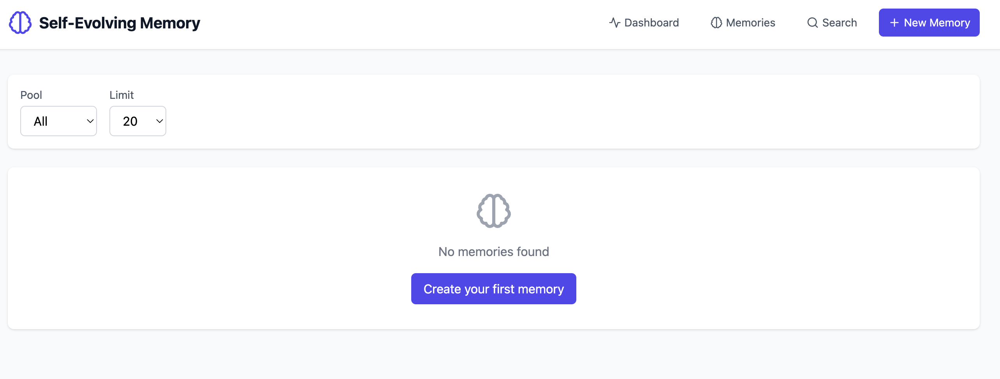

# Self-Evolving Memory

> **AI Agent Memory System** - Production-grade memory infrastructure




🧠 A memory system designed for AI Agents, implementing human-like memory management mechanisms.

## Features

- **Multi-Storage Support**: In-Memory (default), SQLite (local persistence), and PostgreSQL (production)
- **Dual-Pool Mechanism**: Explicit + Implicit Memory
- **Six Types**: Fact, Event, Procedure, Concept, Preference, Context
- **Memory Links**: 8 relation types (related, causes, similar...)
- **Progressive Retrieval**: Spreading Activation Algorithm
- **Memory Decay**: Simulating the human forgetting curve
- **MCP Protocol**: 8 tools for AI Agent invocation
- **Multi-language SDKs**: Python + TypeScript
- **Web UI**: React management interface
- **CLI**: Complete command-line tool

## Quick Start

```bash
# Build
cargo build --release

# Start the server (In-Memory)
./target/debug/mem --serve

# Start the server with SQLite (local persistence)
export DATABASE_URL="sqlite://memory.db?mode=rwc"
./target/debug/mem --serve

# Create memory
./target/debug/mem create "User likes concise replies" --pool implicit --type preference

# Search
./target/debug/mem search "user preferences"

# Interactive mode
./target/debug/mem interactive
```

## Documentation

- [Usage Documentation](docs/USAGE.md)
- [API Documentation](docs/API.md)
- [Architecture Design](docs/ARCHITECTURE.md)

## Architecture

```
┌─────────────────────────────────────────┐
│          Self-Evolving Memory           │
├─────────────────────────────────────────┤
│  ┌─────────┐  ┌─────────┐  ┌─────────┐  │
│  │ CLI     │  │ HTTP API│  │ MCP     │  │
│  └────┬────┘  └────┬────┘  └────┬────┘  │
│       │            │            │        │
│       └────────────┼────────────┘        │
│                    │                     │
│  ┌─────────────────▼─────────────────┐  │
│  │         Memory Core               │  │
│  │  • InMemoryStore                  │  │
│  │  • SpreadingActivation            │  │
│  │  • MemoryConsolidator             │  │
│  │  • EmbeddingService               │  │
│  └───────────────────────────────────┘  │
│                                         │
└─────────────────────────────────────────┘
```

## Core Concepts

### Dual-Pool Mechanism

**Explicit Pool**
- Conscious recall
- Facts, events, procedures
- Information explicitly told by the user

**Implicit Pool**
- Unconscious influence
- Preferences, habits, patterns
- Information inferred from system observation

### Progressive Retrieval

```
Search "user preferences"
    ↓
Found 3 direct matches
    ↓
Spread along links
    ↓
Found 8 related memories
```

## SDK Usage

### Python

```python
from self_evolving_memory import MemoryClient

client = MemoryClient("http://localhost:3000")

# Create
memory = client.create({
    "content": "User prefers communicating in Chinese",
    "pool": "implicit",
    "type": "preference"
})

# Search
results = client.search("user preferences")
```

### TypeScript

```typescript
import { MemoryClient } from 'self-evolving-memory'

const client = new MemoryClient('http://localhost:3000')

const memory = await client.create({
  content: 'User prefers communicating in Chinese',
  pool: 'implicit',
  type: 'preference'
})
```

## Project Structure

```
self-evolving-memory/
├── src/
│   ├── main.rs           # CLI entry
│   ├── memory/           # Core modules
│   │   ├── types.rs      # Data types
│   │   ├── store.rs      # Storage
│   │   ├── spreading.rs  # Progressive retrieval
│   │   ├── consolidation.rs
│   │   └── embedding.rs
│   ├── api/              # HTTP API
│   └── mcp/              # MCP Server
├── sdk/
│   ├── python/           # Python SDK
│   └── typescript/       # TypeScript SDK
├── web-ui/               # React UI
└── docs/                 # Documentation
```

## License

MIT
